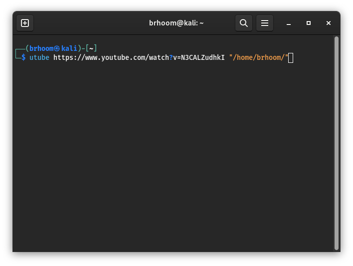
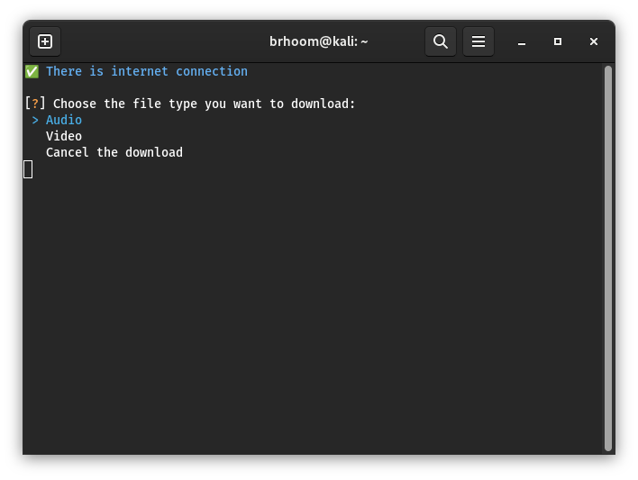
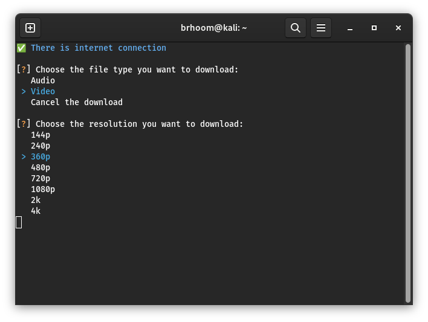
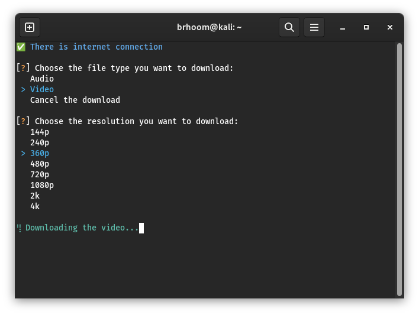

# YouTube Downloader CLI

<p style="font-size: 18px; font-weight: bold; padding:10px; text-align: center;">Enjoying my project? Show your appreciation by starring it on GitHub!</p>

## Description

This is a command-line tool to download YouTube videos from the `Terminal`, written under [Pytube](https://pytube.io/).

it is cross-platform (Windows, Mac, Linux) and can be used in any terminal.

> **Note:** This project is still in development.

## Inspiration

This project was inspired by [Utube](https://github.com/omer73364/uTube/) by [omer73364](https://github.com/omer73364) 🤩

## Features

- User-friendly CLI interface.
- Download a single YouTube in video format or audio.
- Download YouTube shorts.

## TODO

- [x] Publish on PyPI.
- [x] Support downloading sounds (mp3 format).
- [x] Supports all available video resolutions.
- [x] Support shorts.
- [ ] Supports downloading playlists.
- [ ] Playlists organized into folders by their names.
- [ ] Add convert videos into mp3 format.
- [ ] GUI app (nah! Not yet).
- [ ] Any features that you/I can think of.

## Installation

### Method 1: Using Pip

```bash
pip install pyutube
```

### Method 2: Building the project from source

Clone the repository:

```bash
git clone https://github.com/Hetari/pyutube.git
```

Change to the directory:

```bash
cd pyutube
```

Install the requirements:

```bash
pip install -r requirements.txt
```

Build the package:

```bash
python setup.py sdist bdist_wheel
```

Install the package via pip:

```bash
pip3 install dist/*
```

> **Warning:**
>
> In some cases, the package will not install. You may have to add the flag `-H` into the pip command. and if this case, you can use `sudo pip3 install dist/*` instead of `pip3 install dist/*`

Then you can use it in your `Terminal`.

## Usage

Pyutube is very easy to use, here examples of uses:

```bash
pyutube YOUTUBE_LINK [PATH]
```

> **Note:** `[PATH]` is an optional input, the default value is the `terminal` path where the CLI is running (the current working directory).

#### Arguments

- `URL`: The `URL` of the YouTube video. This argument is required.
- `PATH`: The `path` to save the video. Defaults to the current working directory.

#### Options

- `-v` or `--version`: Show the version number.
- `-a` or `--audio`: Download only audio immediately without asking (video or audio).
- `-f` or `--footage`: Download only video immediately without asking (video or audio).

## Examples

### **- Show version:**

```bash
pyutube -v
```

### **- Download shorts, videos or audios:**

1. `pyutube <YOUTUBE_LINK | VIDEO_ID | SHORT_LINK> [the_download_path*]`

   > Don't forget, the path is optional.

2. Then choose the format of the download, video or audio.
3. Choose the resolution if it a video you want to download, otherwise chose audio and it will download it immediately 🔥.

### **- Download audios immediately:**

1. `pyutube <YOUTUBE_LINK | VIDEO_ID | SHORT_LINK> [the_download_path*] -a`

and that's it 🎉.

### **- Download videos immediately:**

1. `pyutube <YOUTUBE_LINK | VIDEO_ID | SHORT_LINK> [the_download_path*] -f`
2. Choose the resolution.

see the video and relax 🎉.

<div style="text-align: center;">
    
    <br />
    <br />
    
    <br />
    <br />
    
    <br />
    <br />
    

</div>

## Contributing

Pull requests are welcome. For major changes, please open an issue first to discuss what you would like to change.
please follow the [contributing guidelines](https://github.com/Hetari/pyutube/blob/main/CONTRIBUTING.md)

## License

This project is licensed under the [MIT License](https://github.com/Hetari/pyutube/blob/main/LICENSE.md).
