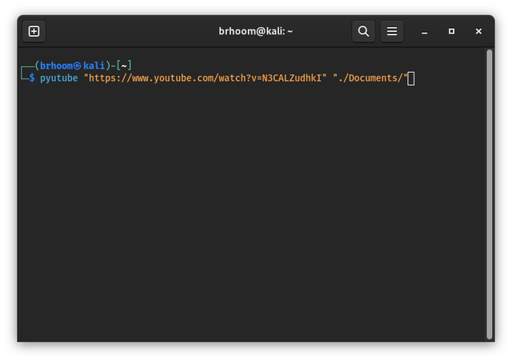
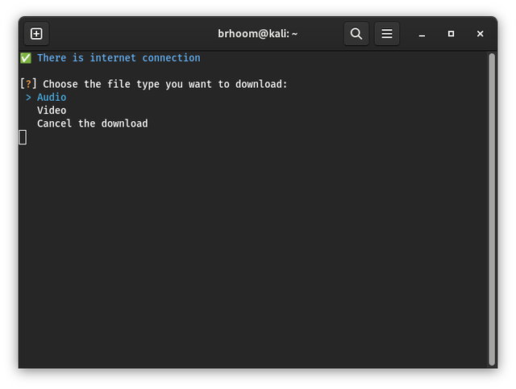
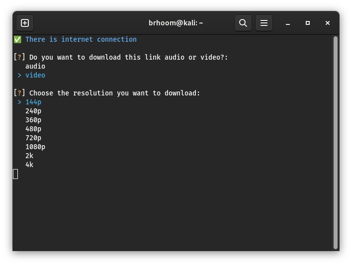

# YouTube Downloader CLI

## Description

This is a command-line tool to download YouTube videos from the `Terminal`.

it is written in [Python](https://www.python.org/), [Pytube](https://pytube.io/), [Inquirer](https://pypi.org/project/inquirer/), [Yaspin](https://yaspin.dev/), and more [see the requirements.txt](requirements.txt) for more info.

it is cross-platform (Windows, Mac, Linux) and can be used in any terminal.

> **Note:** This project is still in development.

## Inspiration

This project was inspired by [uTube](https://github.com/omer73364/uTube/) by [omer73364](https://github.com/omer73364) 🤩

## Features

- User friendly CLI interface.
- Download single YouTube video

## TODO

- [x] Support downloading sounds (mp3 format).
- [x] Supports all available video formats and qualities.
- [ ] Support shorts.
- [ ] Support if there is no specified quality, download the close it one.
- [ ] Supports downloading playlists.
- [ ] Playlists organized to folders by their names.
- [ ] Playlists videos organized and add numbers to their names to make them organized.
- [x] Publish on PyPI.
- [ ] Any features that you/me can think of.

## Installation

Ensure that you have [Pytube](https://pytube.io/) installed on your machine.

### Method 1: Using Pip

> Coming soon...

### Method 2: Building the project from source

Clone the repository:

```bash
git clone https://github.com/Hetari/YouTube-vide-downloader-CLI.git
```

Change to the directory:

```bash
cd YouTube-vide-downloader-CLI
```

Install the requirements:

```bash
pip install -r requirements.txt
```

Build the package:

```bash
python setup.py sdist bdist_wheel
```

Install the package via pip:

```bash
pip3 install dist/uTube-1.0.tar.gz
```

> **Warning:**
>
> In some cases, the package will not install. You may have to add the flag `-H` into the pip command. and if this case, you can use `pip3 install -H dist/uTube-1.0.tar.gz` instead of `pip3 install dist/uTube-1.0.tar.gz`
>
> and if this not working, and you on `Linux` or `Mac`, try the command with `sudo`.

Then you can use it in your `Terminal`.

## Usage

uTube is very easy to use, just type `utube` or `uTube` on your **terminal** or **cmd** then you can use it.

Here examples of uses:

**- Download videos by `3` steps:**

1.  `utube https://www.youtube.com/watch?v=N3CALZudhkI`.
2.  Choose video or audio format. (right now only video is supported)
3.  Choose the resolution if it a video you want to download.

|  |  |
| -------------------------------------------------- | -------------------------------------------------- |

<div style="text-align: center;">
    
</div>

## Contributing

Pull requests are welcome. For major changes, please open an issue first to discuss what you would like to change.
please follow the [contributing guidelines](CONTRIBUTING.md)

## License

This project is licensed under the [MIT License](http://choosealicense.com/licenses/mit/).

